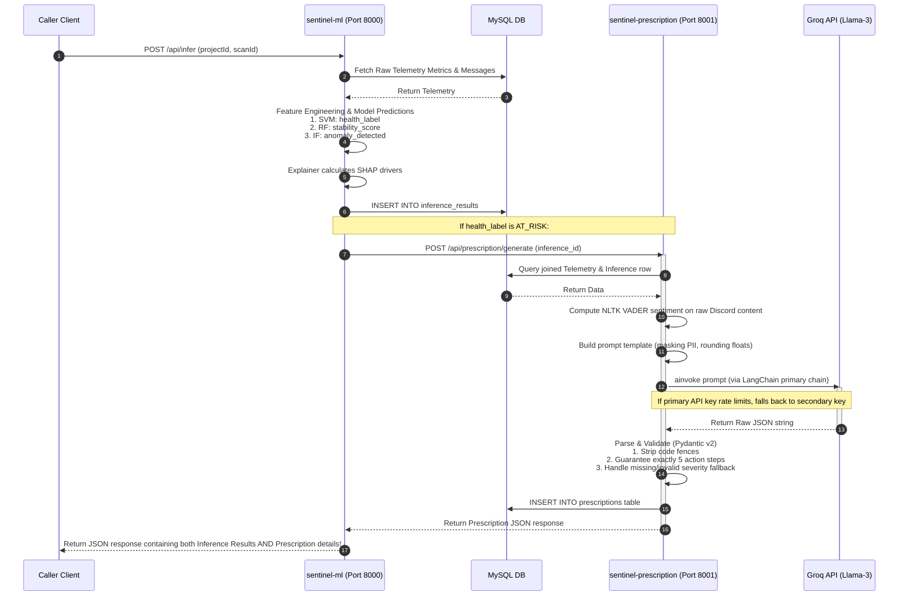

# Sentinel: Project Health & Telemetry Analysis System
## Architectural & File Flow Documentation

This document explains the end-to-end architecture, file details, and execution flows for the three core modules of the project:
1. **Module 1: Sentinel API Ingestion Gateway** (`api-gateway`)
2. **Module 2: Sentinel ML Inference Service** (`sentinel-ml`)
3. **Module 3: Generative AI Prescription Engine** (`sentinel-prescription`)

---

## 1. System Architecture Overview

Sentinel is a microservice-based system designed to monitor and evaluate software project health by extracting metrics from three developer platforms (**GitHub**, **Jira**, and **Discord**), processing those signals using machine learning models, and generating detailed remediation prescriptions using a LLM-driven prescription engine.

```mermaid
flowchart TD
    subgraph Module 1: Ingestion Gateway (api-gateway)
        Scheduler[scheduler.js] -->|Cron Trigger| Service[telemetryService.js]
        Router[telemetryRouter.js] -->|HTTP POST /collect| Service
        Service --> GH_Adapter[githubAdapter.js]
        Service --> Jira_Adapter[jiraAdapter.js]
        Service --> Discord_Adapter[discordAdapter.js]
        Service -->|Sequelize ORM| DB[(MySQL Database: sentinel_health)]
    end

    subgraph External APIs
        GH_Adapter -->|Octokit API| GitHub[(GitHub API)]
        Jira_Adapter -->|Axios REST| Jira[(Jira Cloud API)]
        Discord_Adapter -->|Discord.js| Discord[(Discord Gateway)]
    end

    subgraph Module 2: ML Inference Engine (sentinel-ml)
        ML_API[main.py: FastAPI] -->|POST /api/infer| FE[feature_engineering.py]
        DB -->|Read Raw Metrics & Messages| FE
        FE -->|Vector Construction & Imputation| SVM_Model[models/svm_classifier.joblib]
        FE -->|Vector Construction & Imputation| RF_Model[models/rf_stability.joblib]
        FE -->|Vector Construction & Imputation| IF_Model[models/isolation_forest.joblib]
        
        SVM_Model -->|Predict Health| Label[HEALTHY / AT_RISK]
        RF_Model -->|Predict Risk Probability| StabScore[Stability Score]
        IF_Model -->|Detect Outliers| Anomaly[Anomaly Flag]
        
        FE -->|SHAP Values| Explainer[explainer.py: Explainer]
        RF_Model --> Explainer
        Explainer -->|Top 3 Risk Drivers| DB
    end

    subgraph Module 3: AI Prescription Engine (sentinel-prescription)
        Presc_API[main.py: FastAPI] -->|POST /api/prescription/generate| PService[prescription_service.py]
        ML_API -->|Awaits synchronous trigger| Presc_API
        DB -->|Read Inference & Telemetry| PService
        PService -->|Build Prompt| PB[prompt_builder.py]
        PB -->|LLM Prompt| Client[llm_client.py: LangChain Client]
        Client -->|Llama-3 70B via Groq| Groq[(Groq Primary / Fallback API)]
        Groq -->|Raw JSON response| Parser[response_parser.py: Pydantic v2]
        Parser -->|Validated Prescription| PService
        PService -->|Save to prescriptions table| DB
    end
```

---

## 2. File-by-File Details

### Module A: `api-gateway` (Node.js & Express)
The API Gateway is responsible for triggering scans, pulling developer logs, and persisting them in MySQL.

1. **`server.js`**
   * **Purpose**: Application entry point.
   * **Mechanism**: Sets up Express, body parsers, and mounts `telemetryRouter` on `/api/telemetry`. On startup, it triggers database table synchronization (`syncDB()`), initializes the automatic background cron job (`initScheduler()`), and starts listening on the designated port.
2. **`config.js`**
   * **Purpose**: Centralized environment configuration.
   * **Mechanism**: Uses `dotenv` to load parameters from `.env`. Defines database credentials (MySQL host, port, database, credentials), GitHub access tokens, Jira REST base URL & credentials, Discord bot parameters, and application settings (port, scanning intervals).
3. **`scheduler.js`**
   * **Purpose**: Handles background telemetry scanning intervals.
   * **Mechanism**: Uses `node-cron` to schedule scans based on `scanIntervalMinutes` (configured in `.env`, defaults to 30 mins). On schedule, it queries all registered projects from the database and loops through them to run `runTelemetryScan(projectId)` sequentially. It also triggers an immediate scan on startup.
4. **`db/connection.js`**
   * **Purpose**: Database connection helper.
   * **Mechanism**: Establishes a database connection pool using the Sequelize ORM pointing to the MySQL instance. SQL logging is disabled for cleaner console output.
5. **`db/sync.js`**
   * **Purpose**: Synchronizes JavaScript Sequelize models with MySQL tables.
   * **Mechanism**: Authenticates the connection and runs `sequelize.sync({ alter: true })`. This modifies existing tables to fit the JS schemas without dropping tables or losing historical metrics.
6. **`db/schema.sql`**
   * **Purpose**: Declarative MySQL schema initialization.
   * **Mechanism**: Explicit DDL script creating the `sentinel_health` database and tables (`projects`, `telemetry_scans`, `github_metrics`, `jira_metrics`, `discord_metrics`, `discord_messages`) with appropriate data types, auto-increment keys, and foreign keys.
7. **`models/Project.js`**
   * **Purpose**: Represents the `projects` table.
   * **Fields**: `project_id`, `name`, `github_owner`, `github_repo`, `jira_project_key`, `discord_channel_id`, `created_at`.
8. **`models/TelemetryScan.js`**
   * **Purpose**: Tracks every scan instance.
   * **Fields**: `scan_id`, `project_id` (foreign key), `scanned_at`, `status` (`complete`, `partial`, `failed`).
9. **`models/GithubMetric.js`**
   * **Purpose**: Stores Github scan telemetry.
   * **Fields**: `id`, `scan_id` (foreign key), `commit_frequency`, `code_churn`, `pr_cycle_time_hours`, `top_contributor`, `contributor_count`, `collected_at`.
10. **`models/JiraMetric.js`**
    * **Purpose**: Stores Jira project management metrics.
    * **Fields**: `id`, `scan_id` (foreign key), `sprint_velocity_planned`, `sprint_velocity_completed`, `avg_task_aging_days`, `backlog_growth_rate`, `collected_at`.
11. **`models/DiscordMetric.js`**
    * **Purpose**: Stores Discord interaction metrics.
    * **Fields**: `id`, `scan_id` (foreign key), `messages_per_day`, `active_users`, `collected_at`.
12. **`models/DiscordMessage.js`**
    * **Purpose**: Stores raw text messages for sentiment analysis.
    * **Fields**: `id`, `scan_id` (foreign key), `message_id` (unique), `author_id`, `author_name`, `content` (text), `sent_at`.
13. **`adapters/githubAdapter.js`**
    * **Purpose**: GitHub integration layer.
    * **Mechanism**: Initializes an Octokit GitHub client. Queries commits from the last 30 days to calculate `commit_frequency` (commits per day) and contributor distributions. Fetches stats for each individual commit to compute overall `code_churn` (lines added + deleted). Queries recent closed pull requests to compute `pr_cycle_time_hours` (average hours from creation to merge).
14. **`adapters/jiraAdapter.js`**
    * **Purpose**: Jira project key tracker.
    * **Mechanism**: Leverages Axios to connect to Jira Cloud APIs. Performs JQL (Jira Query Language) searches on issues created/resolved in the last 30 days to estimate backlog growth and velocity. Measures creation-to-now timestamps of unresolved issues to calculate `avg_task_aging_days`.
15. **`adapters/discordAdapter.js`**
    * **Purpose**: Discord channel text reader.
    * **Mechanism**: Uses `discord.js` to log a bot client into the Guild. Fetches up to 500 messages (maximum) from the channel spanning the last 7 days. Computes `messages_per_day` and active users, formatting the raw texts and metadata for database persistence.
16. **`services/telemetryService.js`**
    * **Purpose**: Telemetry pipeline coordinator.
    * **Mechanism**: Creates a database entry in `telemetry_scans` with a default state of `partial`. Concurrently fires promises fetching metrics for GitHub, Jira, and Discord using the adapters. Once resolved via `Promise.allSettled`, it inserts all records. If all three sources succeed, the scan status updates to `complete`; if at least one succeeds, it stays `partial`; otherwise, it updates to `failed`.
17. **`routes/telemetryRouter.js`**
    * **Purpose**: REST HTTP router.
    * **Endpoints**:
      * `POST /collect`: Triggers manual telemetry scans.
      * `GET /:projectId/latest`: Obtains latest scan metrics.
      * `GET /:projectId/history`: Obtains history list over a default range of 30 days.
      * `GET /:projectId/messages?scan_id=X`: Obtains messages scanned under a specific scan.
18. **`test-adapters.js`**
    * **Purpose**: Command-line verification script.
    * **Mechanism**: Sequentially executes the GitHub, Jira, and Discord adapters using mock settings to verify API authorization and responses.

*Note: `routes/authRouter.js`, `routes/projectRouter.js`, `middleware/authMiddleware.js`, `middleware/errorMiddleware.js`, `middleware/rateLimiter.js`, and `services/normalisationService.js` are currently blank project templates.*

---

### Module B: `sentinel-ml` (Python & FastAPI)
The Machine Learning service is responsible for transforming raw metrics, running classifiers and explainer modules, and saving intelligence reports.

1. **`db.py`**
   * **Purpose**: SQLAlchemy connection engine.
   * **Mechanism**: Reads configuration parameters from `.env`. Sets up a MySQL connection pool using SQLAlchemy and PyMySQL (`pool_size=10`, `max_overflow=20`, `pool_timeout=30`, `pool_recycle=1800`) to guarantee thread safety.
2. **`seed_db.py`**
   * **Purpose**: Data generator for training datasets.
   * **Mechanism**: Constructs SQL tables if missing. Generates 60 historical scan records for `ProjectAlpha` in MySQL. Approximately 30% of scans are generated with anomalous or poor health indices (low commit activity, long PR cycles, single contributor silos, low completed velocity, negative Discord messages) to simulate an unbalanced, realistic learning environment.
3. **`feature_engineering.py`**
   * **Purpose**: Raw data retrieval, aggregation, and mathematical feature synthesis.
   * **Mechanism**:
     * Downloads NLTK's VADER sentiment analyzer dictionary.
     * Extracts database metrics and VADER compound polarity scores on Discord text messages.
     * Computes the `sprint_velocity_ratio` (`completed_velocity / planned_velocity`).
     * Applies mean-imputation to handle any missing values using historical project columns.
     * Computes logical flags:
       * `velocity_drop_flag`: `sprint_velocity_ratio < 0.6`
       * `burnout_flag`: `messages_per_day < 5.0` AND average `sentiment_score < -0.2`
       * `silo_flag`: `contributor_count == 1`
       * `aging_flag`: `avg_task_aging_days > 7`
4. **`labeller.py`**
   * **Purpose**: Label generator for supervised training.
   * **Mechanism**: Applies a deterministic ruleset to label historical data points (1 = `AT_RISK`, 0 = `HEALTHY`). It marks a scan as `AT_RISK` if:
     * `sprint_velocity_ratio < 0.6` OR
     * `avg_task_aging_days > 7` OR
     * `pr_cycle_time_hours > 48` OR
     * `sentiment_score < -0.2` OR
     * Normalized code churn (MinMaxScaler on `code_churn`) `> 0.85`.
5. **`train.py`**
   * **Purpose**: Model training script.
   * **Mechanism**:
     * Runs feature engineering and labelling.
     * Performs a stratified 80/20 train/test split.
     * Balances classes on the training set using **SMOTE** (Synthetic Minority Over-sampling Technique), dynamically tuning neighborhood counts if minority clusters are small.
     * Normalizes the numeric variables in training data to `[0,1]` using `MinMaxScaler` (and saves the scaler artifact).
     * Trains a Support Vector Machine Classifier (**SVC**) with an RBF kernel (for binary classification).
     * Trains a **Random Forest Classifier** (for regression probability / stability scoring).
     * Trains an unsupervised **Isolation Forest** on the complete dataset (for anomaly detection).
     * Serializes all components to disk (`models/*.joblib`) alongside an evaluation report (`models/evaluation_report.txt`).
6. **`explainer.py`**
   * **Purpose**: Explainability layer using SHAP.
   * **Mechanism**: Wraps a SHAP `TreeExplainer` around the Random Forest and a SHAP `KernelExplainer` around the SVM. Analyzes input features and sorts them based on their absolute SHAP values. Translates the top 3 risk factors into user-friendly diagnostic texts (e.g. `"burnout_flag": "Developer burnout pattern detected"`).
7. **`main.py`**
   * **Purpose**: FastAPI microservice endpoint.
   * **Endpoints**:
     * `POST /api/infer`: Evaluates project health for a given `scan_id`. It queries the DB for raw metrics, processes features, scales them, evaluates class predictions (SVM), calculates stability (RF), flags anomalies (IF), extracts SHAP drivers, saves the intelligence results directly into MySQL, and triggers Module 3 synchronously if the label is `AT_RISK` to return the AI prescription in the payload.
     * `POST /api/train`: Asynchronously triggers `train.py` as a FastAPI background task.
     * `GET /api/health`: Provides uptime state, model load status, and MySQL connection checks.
     * `GET /api/infer/history/{project_id}`: Queries past inference records.
8. **`test_infer.py`**
   * **Purpose**: Command-line validation helper.
   * **Mechanism**: Runs the scaling and predictor steps on scan ID 1 to output diagnostic logs to the terminal.

---

### Module C: `sentinel-prescription` (Generative AI Prescription Engine)
The Generative AI service reads metrics, generates structured prompts, fetches prescriptions from Groq, validates the format, and persists recommendations.

1. **`db.py`**
   * **Purpose**: SQLAlchemy connection engine.
   * **Mechanism**: Connects to the same `sentinel_health` database using SQLAlchemy with a thread-safe connection pool (`pool_size=10`). Overrides default env values via `load_dotenv(override=True)`.
2. **`prescription_schema.sql`**
   * **Purpose**: Schema declaration file.
   * **Mechanism**: Script to initialize the `prescriptions` table storing root cause summaries, severity levels, action steps, token counts, and Groq metadata linked to inferences and scans.
3. **`apply_schema.py`**
   * **Purpose**: Database schema applier.
   * **Mechanism**: Auto-executes the SQL script against MySQL safely using `.env` credentials, using utf8mb4 encoding and bypassing Windows terminal unicode emoji print limitations.
4. **`prompt_builder.py`**
   * **Purpose**: Generates semantic prompt templates for the LLM.
   * **Mechanism**: Maps the row metrics (Jira velocity, task aging, Discord messages, VADER sentiment, GitHub commit frequency, and code churn) and SHAP drivers into a detailed project failure diagnosis template, masking user names and replacing nulls with `"N/A"`.
5. **`llm_client.py`**
   * **Purpose**: LangChain v1 Groq client with fallback support.
   * **Mechanism**: Imports `init_chat_model` and `ChatPromptTemplate` from `langchain_core`. Combines a primary Groq API key and a fallback Groq API key using `.with_fallbacks([fallback_llm])`. Executes fully asynchronously via `.ainvoke()`, wrapping requests in a 3-attempt exponential back-off handler.
6. **`response_parser.py`**
   * **Purpose**: Parses, normalizes, and validates LLM responses.
   * **Mechanism**: Uses **Pydantic v2** `BaseModel` and field validators. Strips Markdown fences, parses JSON, and pads/trims action steps to guarantee exactly 5 steps. If severity is missing or invalid, it infers it from the `stability_score`.
7. **`prescription_service.py`**
   * **Purpose**: Generative AI pipeline coordinator.
   * **Mechanism**: Orchestrates the prescription cycle. Fetches inference details, verifies the `AT_RISK` label, joins telemetry tables, calculates real VADER messages sentiment, runs the LLM client, and parses response structures. If both keys are offline or parsing fails, it safely saves fallback logs to prevent process crashes.
8. **`trigger.py`**
   * **Purpose**: Module 2 integration helper.
   * **Mechanism**: Contains `auto_trigger_prescription` which sends an HTTP POST request to the prescription server from `sentinel-ml/main.py` when an `AT_RISK` project is identified, returning the prescription JSON.
9. **`main.py`**
   * **Purpose**: FastAPI microservice endpoint.
   * **Endpoints**:
     * `POST /api/prescription/generate`: Triggers a prescription manually.
     * `POST /api/prescription/generate-all-pending`: Batches all un-prescribed `AT_RISK` rows using `asyncio.Semaphore(3)`.
     * `GET /api/prescription/{project_id}/latest`: Gets the latest prescription.
     * `GET /api/prescription/{project_id}/history`: Gets prescription history.
     * `GET /api/prescription/health`: Verifies service status, primary/fallback key config status, and DB connections.

---

## 3. Step-by-Step Execution Flows

### End-to-End Inference and Prescription Flow

This sequence diagrams the entire execution path when a caller requests an inference status update:


