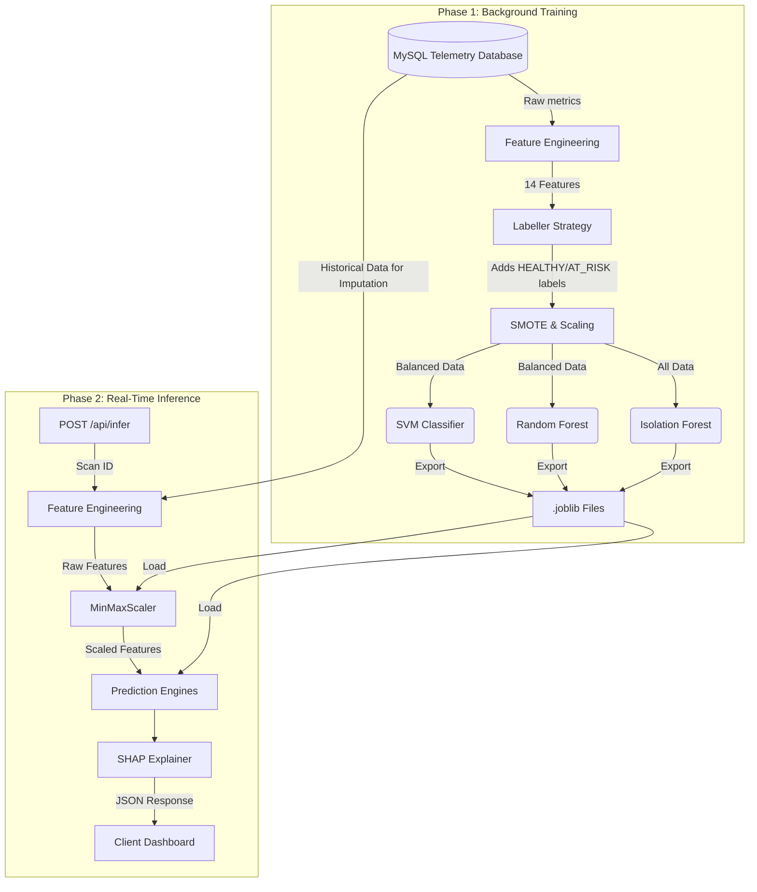

# Sentinel-Health AI: ML Inference Module

Welcome to the **Sentinel-Health AI ML Inference Module**! This directory contains the complete backend pipeline to detect and manage software project failures. It ingests data from your MySQL telemetry database, performs feature engineering, trains machine learning models, and serves real-time project health predictions via a FastAPI service.

## 🔄 Working Flow (How it Works)

The workflow of the Sentinel-Health model operates in two main phases: **Training Phase** and **Inference Phase**.



1. **Telemetry Collection**: Your Node.js adapters continually fetch data from GitHub, Jira, and Discord and store it in MySQL.
2. **Model Training**: The `train.py` pipeline reads all historical scans, calculates 14 complex features, applies rules to determine if past scans were "At Risk", and trains three separate models. It saves the "brain" of these models as binary `.joblib` files.
3. **Real-time Inference**: When you ping `/api/infer`, the system pulls the specific scan, runs it through the pre-trained models, and uses **SHAP** to figure out *exactly* why the models gave that score. It returns the label, stability score, and the top 3 reasons (Risk Drivers) for the score.

---

## 📂 File Directory & Responsibilities

Understanding this module is simple once you know what each file is responsible for:

- **`feature_engineering.py`**: The "Data Extractor". Pulls raw data from GitHub, Jira, and Discord tables. It calculates derived metrics like `sprint_velocity_ratio`, aggregates VADER sentiment scores for Discord messages, and imputes any missing data using historical averages so the models never crash.
- **`labeller.py`**: The "Ground Truth Generator". Since AI needs to know what "failure" looks like to learn, this script strictly applies your specific rules (e.g. `pr_cycle_time_hours > 48` or `sentiment_score < -0.2`) to label historical data as `HEALTHY (0)` or `AT_RISK (1)`.
- **`train.py`**: The "Trainer". Coordinates the entire learning process. It splits data (80/20), balances the classes using SMOTE (Synthetic Minority Over-sampling Technique), scales numbers to a `[0,1]` range, trains the SVM, Random Forest, and Isolation Forest models, and exports them.
- **`explainer.py`**: The "Interpreter". Machine Learning models are often "black boxes". This script uses **SHAP** (SHapley Additive exPlanations) to crack open the model's decision and map the math back to human-readable strings like *"Developer burnout pattern detected"*.
- **`main.py`**: The "API Server". Uses FastAPI to expose the models to the outside world. It loads the `.joblib` files into memory instantly on startup so that inferences take milliseconds.
- **`seed_db.py`**: A helper script to inject realistic, dummy telemetry data into your database for testing purposes when you don't have enough real data.
- **`inference_schema.sql`**: The SQL schema to create the final `inference_results` table where all API predictions are permanently logged.

---

## ⚙️ Feature Engineering & Labelling Strategy

### The 14-Feature Vector
The models evaluate projects based on these exact features:
1. `commit_frequency` (GitHub)
2. `code_churn` (GitHub)
3. `pr_cycle_time_hours` (GitHub)
4. `contributor_count` (GitHub)
5. `sprint_velocity_ratio` (Jira)
6. `avg_task_aging_days` (Jira)
7. `backlog_growth_rate` (Jira)
8. `messages_per_day` (Discord)
9. `active_users` (Discord)
10. `sentiment_score` (Discord - VADER Compound Avg)
11. `velocity_drop_flag` (Derived)
12. `burnout_flag` (Derived)
13. `silo_flag` (Derived)
14. `aging_flag` (Derived)

### Labelling
A project scan is labeled as `AT_RISK` if **ANY** of the following thresholds are breached:
- Sprint velocity ratio < `0.6`
- Average task aging > `7 days`
- PR cycle time > `48 hours`
- Team sentiment score < `-0.2` (Negative)
- Normalized Code churn > `0.85`

---

## ❓ FAQ: Why can't I read the `.joblib` files?

The `.joblib` files inside the `models/` directory **do not contain source code**. 

Instead, they are **binary serialized files** (similar to `.zip` or `.exe` files). When we run the training pipeline (`train.py`), the Machine Learning models "learn" mathematical weights, decision tree structures, and scaling metrics from your MySQL data. 

The `joblib` library takes that entire trained Python object from the computer's RAM and "freezes" it into a binary file. This allows the FastAPI server to instantly load the mathematical state back into memory for real-time inference without needing to retrain the model every time. Because it's purely mathematical binary data, your code editor cannot read it as text. The actual "code" that defines how these models work is located inside `train.py`.

---

## 🚀 Running the API

### Installation
Ensure your `.env` contains your correct MySQL credentials, then run:
```bash
pip install -r requirements.txt
```

### Initial Data Seeding (Optional)
If you don't have enough telemetry data in your database to train the models (minimum 10 rows), you can seed realistic dummy data:
```bash
python seed_db.py
```

### Starting the Server
Start the inference server on port `8000`:
```bash
python -m uvicorn main:app --port 8000
```

---

## 📡 API Endpoints

### 1. Initial Training (Must be run once before inference)
```http
POST /api/train
```
Runs the training pipeline asynchronously in the background.

### 2. Real-Time Inference
```http
POST /api/infer
```
**Body:** `{"project_id": "ProjectAlpha", "scan_id": 1}`

Runs the full pipeline (MySQL Extraction -> Scaling -> SVM -> RF -> Isolation Forest -> SHAP Explainer) and saves the results directly to the `inference_results` MySQL table.

### 3. Check Health History
```http
GET /api/infer/history/{project_id}?limit=10
```
Returns a chronological timeline of past health evaluations and risk drivers for a specific project.

### 4. Service Health
```http
GET /api/health
```
Validates if the API is running, the ML models are loaded into memory, and the Database connection is active.


The .joblib files do not contain source code. Instead, they are binary serialized files (similar to .zip or .exe files). When we run the training pipeline (train.py), the Machine Learning models "learn" the mathematical weights, decision tree structures, and scaling metrics from your data. joblib takes that entire trained Python object from the computer's RAM and freezes it into a binary file so it can be instantly loaded back into memory later for real-time inference without needing to be retrained.

Because it's purely mathematical binary data, your code editor cannot read it as text.

The actual "code" that defines how these models work and how they are trained is located inside train.py.